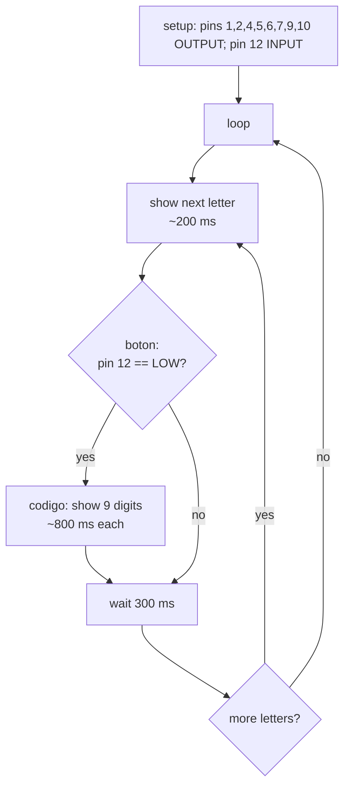

# Arduino 7-Segment Display Controller

A single Arduino sketch that drives one 7-segment display directly from digital pins, scrolling a short letter message and, when a push button is pressed, showing a student-code digit sequence.

> **Original implementation notice**
> This repository preserves the original implementation of the project. The source code has intentionally not been refactored or modernized in order to retain the historical context and original development approach.
> The source code appears to represent the original implementation developed as a student exercise (see [Project Context](#project-context)).

---

## Project Overview

| | |
|---|---|
| **Type** | Embedded / microcontroller sketch (Arduino) |
| **Size** | 1 source file, 273 lines, 16 functions |
| **Originally uploaded** | 2021-02-20 (git history) |
| **Author** | Baruch Lopez |
| **License** | MIT ([LICENSE](LICENSE)) |
| **Project origin** | Coursework / Assignment — **inferred**, see below |

The sketch turns individual segments of a 7-segment display on and off with `digitalWrite()` to form letters and digits. Each character has its own hand-written function. A button on pin 12 interrupts the letter sequence to display a numeric code.

## Project Context

**Classification: Coursework / Assignment (Inferred).**

The repository contains no assignment statement, PDF, report or course reference, so the academic context cannot be confirmed. The classification is inferred from:

- the original file name `PtoProfeMAScambioACodigoDeAlumno.ino` (Spanish: *"Profe"* = teacher, *"cambio a código de alumno"* = switch to student code);
- the current file name `ejercicio-alumno` (*"student exercise"*);
- the behavior of the code, which displays a message and then a nine-character sequence the file name identifies as a *student code*.

University, course and assignment requirements: *The original repository does not provide enough information to determine this.*
See [docs/project-context.md](docs/project-context.md) for the full evidence table.

## Problem Statement

Display readable characters on a single 7-segment display using only an Arduino's digital pins (no driver IC, no library), and react to a push button by switching what is shown. *(Inferred from the code.)*

## Objective

- Render a fixed letter message, one character at a time, in a continuous loop. **(Confirmed)**
- When the button is pressed, render the student's code digit by digit. **(Confirmed by code; "student code" meaning inferred from the file name)**

## Repository Structure

```
.
├── README.md                    ← this file
├── LICENSE                      ← MIT license (original, 2021)
├── AGENTS.md                    ← guardrails for automated contributors
├── .gitattributes               ← keeps the sketch's CRLF bytes untouched
├── .gitignore
├── src/
│   └── ejercicio-alumno/
│       └── ejercicio-alumno.ino ← ORIGINAL sketch (unchanged)
└── docs/
    ├── project-context.md       ← origin, evidence, timeline
    ├── code-overview.md         ← function-by-function walkthrough
    ├── hardware.md              ← pin/segment mapping reconstructed from code
    ├── possible-improvements.md ← NOT applied; kept separate from the original
    ├── sdlc/
    │   ├── intent.md            ← why the project exists (reconstructed)
    │   ├── spec.md              ← as-built behavioral specification
    │   └── plan.md              ← implementation & repository-refactor plan
    └── archive/
        ├── README.md            ← archive index
        └── README.es-2024.md    ← previous Spanish README (2024), preserved
```

The sketch lives in a folder with the same name as the `.ino` file because the Arduino IDE requires that layout to open a sketch.

## Original Implementation

The file [`src/ejercicio-alumno/ejercicio-alumno.ino`](src/ejercicio-alumno/ejercicio-alumno.ino) is byte-for-byte identical to the file uploaded in 2021 (same git blob `c0f6015`, CRLF line endings preserved). Only its location and file name changed:

| Date | Path |
|---|---|
| 2021-02-20 | `PtoProfeMAScambioACodigoDeAlumno.ino` |
| 2025-03-31 | `ejercicio-alumno.ino.ino` |
| Repository refactor | `src/ejercicio-alumno/ejercicio-alumno.ino` |

Known issues (unused pin modes, Serial-pin conflict, a contradictory legacy README, etc.) are documented in [docs/possible-improvements.md](docs/possible-improvements.md) and deliberately **not** fixed.

## Technologies

- **Arduino (C/C++ sketch, `.ino`)** — `setup()`/`loop()`, `pinMode`, `digitalWrite`, `digitalRead`, `delay`. **(Confirmed)**
- **Single-digit 7-segment display** and **push button**. **(Confirmed by code usage)**
- No external libraries. **(Confirmed)**
- Specific board model: **Unknown** (the pins used, 1–12, exist on the Uno/Nano/Mega family).

## How It Works



1. `loop()` walks through ten display steps: **P, U, T, O, (blank), P, R, O, F, E**, then a blank.
2. Between steps, `boton()` reads pin 12. A `LOW` reading (button pressed, active-low) calls `codigo()`.
3. `codigo()` shows nine digit patterns (the student code), each held for ~800 ms.
4. Each character function writes the full pin state for the display, so no explicit clearing is needed between characters.

Details: [docs/code-overview.md](docs/code-overview.md).

## Inputs and Outputs

| Direction | Pin(s) | Meaning |
|---|---|---|
| Input | D12 | Push button, **active LOW** (no internal pull-up enabled → an external pull-up is *inferred*) |
| Output | D1, D2, D4, D6, D7, D9, D10 | Segments **e, d, c, b, a, f, g** (mapping reconstructed from the glyphs; see [docs/hardware.md](docs/hardware.md)) |
| Output (always LOW) | D5, D8 | Never driven HIGH; likely tied to the display's DP / common pins |

The reconstructed mapping suggests Arduino pin *N* was wired to display pin *N* of a standard 10-pin single-digit display, driven as **common cathode** (HIGH = segment on). This is an inference and cannot be confirmed without the original circuit.

## Running the Project

The only reliably determinable steps:

1. Open `src/ejercicio-alumno/ejercicio-alumno.ino` in the Arduino IDE.
2. Select your board and port, then upload.

Wiring must follow the reconstructed mapping in [docs/hardware.md](docs/hardware.md). Note that **D1 is the hardware Serial TX pin** on Uno-class boards; disconnecting the segment wired to D1 during upload may be necessary. The original board, display part number and resistor values are **Unknown**.

## Documentation

- [Project context](docs/project-context.md)
- [Code overview](docs/code-overview.md)
- [Hardware / pin mapping](docs/hardware.md)
- [Possible improvements (not applied)](docs/possible-improvements.md)
- AI-native SDLC artifacts: [intent](docs/sdlc/intent.md) · [spec](docs/sdlc/spec.md) · [plan](docs/sdlc/plan.md)
- [Previous Spanish README (archived)](docs/archive/README.es-2024.md)

## Historical Note

This repository was later reorganized and documented to improve readability and preserve the historical context of the original project. The original source code remains unchanged.

The previous README (added in 2024, in Spanish) described a generic 0–9 counter, a `diagram.png`, and example projects that do not exist in this repository, and its pin table does not match the code. It is kept unmodified in [docs/archive/](docs/archive/README.es-2024.md) for reference; this README supersedes it.
